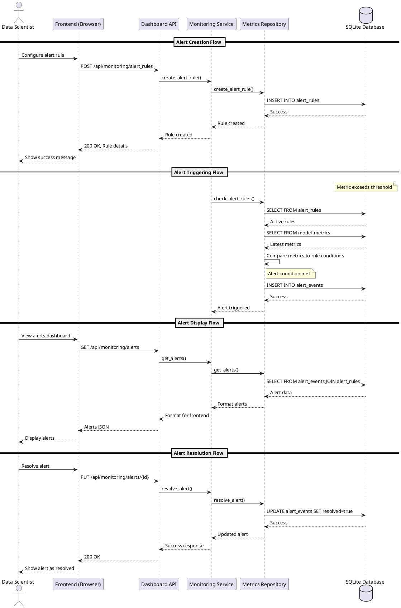

# IoTSphere Monitoring & Alerts Architecture

## Overview

The IoTSphere Monitoring & Alerts system provides a comprehensive solution for tracking model performance metrics, detecting anomalies, and alerting stakeholders to potential issues. This document describes the architecture and flow of the monitoring alerts subsystem.

## Key Components

### 1. Database Structure

The monitoring system uses a SQLite database with several key tables:

- **models**: Stores information about ML models being monitored
  - Columns: `id`, `name`, `description`, `created_at`, `updated_at`, `archived`
- **alert_rules**: Defines conditions that trigger alerts
  - Columns: `id`, `model_id`, `metric_name`, `threshold`, `condition`, `severity`, `created_at`, `active`
- **alert_events**: Records instances when alert rules are triggered
  - Columns: `id`, `rule_id`, `model_id`, `metric_name`, `metric_value`, `severity`, `created_at`, `resolved`, `resolved_at`

### 2. Backend Components

- **ModelMetricsRepository**: Responsible for retrieving model metrics and alert data
  - Handles database queries and can fall back to mock data when necessary
  - Implements TDD principles by adapting to expected test behaviors
- **ModelMonitoringService**: Provides business logic for monitoring operations
  - Acts as a service layer between the API and data repositories
- **DashboardAPI**: Exposes HTTP endpoints for monitoring dashboard functionality
  - Formats data to match frontend expectations

### 3. Frontend Components

- **Monitoring Dashboard**: Displays real-time metrics and alerts
- **Alerts Tab**: Provides alert management capabilities
  - Filtering by model, severity, and status
  - Alert resolution workflow

## Architecture Diagrams

### System Context Diagram

```plantuml
@startuml System Context
!include https://raw.githubusercontent.com/plantuml-stdlib/C4-PlantUML/master/C4_Context.puml

Person(user, "Data Scientist", "Monitors model performance")
System(iotsphere, "IoTSphere Platform", "Provides ML model monitoring and alert capabilities")
System_Ext(mlModels, "ML Models", "Deployed machine learning models")

Rel(user, iotsphere, "Views dashboards and manages alerts")
Rel(mlModels, iotsphere, "Sends performance metrics")
Rel(iotsphere, user, "Notifies about model issues")

@enduml
```

### Container Diagram

```plantuml
@startuml Container Diagram
!include https://raw.githubusercontent.com/plantuml-stdlib/C4-PlantUML/master/C4_Container.puml

Person(user, "Data Scientist", "Monitors model performance")
System_Boundary(iotsphere, "IoTSphere Platform") {
    Container(web_app, "Web Application", "HTML, CSS, JavaScript", "Provides monitoring UI")
    Container(api_server, "API Server", "Python, FastAPI", "Processes monitoring data and alerts")
    ContainerDb(database, "SQLite Database", "SQLite", "Stores model metrics and alerts")
}

System_Ext(mlModels, "ML Models", "Deployed machine learning models")

Rel(user, web_app, "Views dashboards and manages alerts", "HTTPS")
Rel(web_app, api_server, "Makes API calls", "HTTP/JSON")
Rel(api_server, database, "Reads/writes data", "SQL")
Rel(mlModels, api_server, "Sends metrics", "HTTP/JSON")
Rel(api_server, user, "Notifies about issues", "Email/SMS")

@enduml
```

### Component Diagram

```plantuml
@startuml Component Diagram
!include https://raw.githubusercontent.com/plantuml-stdlib/C4-PlantUML/master/C4_Component.puml

Container_Boundary(web, "Web Application") {
    Component(dashboard_ui, "Dashboard UI", "JavaScript, HTML, CSS", "Displays monitoring metrics and visualizations")
    Component(alerts_ui, "Alerts UI", "JavaScript, HTML, CSS", "Displays and manages alerts")
}

Container_Boundary(api, "API Server") {
    Component(dashboard_api, "Dashboard API", "Python", "Provides monitoring dashboard endpoints")
    Component(monitoring_service, "Monitoring Service", "Python", "Implements monitoring business logic")
    Component(metrics_repo, "Metrics Repository", "Python", "Manages model metrics data")
    Component(alert_service, "Alert Service", "Python", "Processes and manages alerts")
}

ContainerDb(db, "SQLite Database", "Stores metrics and alerts")

Rel(dashboard_ui, dashboard_api, "Requests metrics data", "HTTP/JSON")
Rel(alerts_ui, dashboard_api, "Requests alert data", "HTTP/JSON")
Rel(dashboard_api, monitoring_service, "Uses", "Python method calls")
Rel(monitoring_service, metrics_repo, "Uses", "Python method calls")
Rel(monitoring_service, alert_service, "Uses", "Python method calls")
Rel(metrics_repo, db, "Reads/writes metrics", "SQL")
Rel(alert_service, db, "Reads/writes alerts", "SQL")

@enduml
```

### Sequence Diagram for Alert Flow



## Implementation Details

### Alert Lifecycle

1. **Creation**: Alert rules are created with specific thresholds and conditions
2. **Triggering**: The system continuously evaluates metrics against rules
3. **Notification**: When a rule is triggered, an alert event is created
4. **Resolution**: Users can acknowledge and resolve alerts

### API Endpoints

| Endpoint | Method | Description |
|----------|--------|-------------|
| `/api/monitoring/alerts` | GET | Retrieve all alerts with filtering options |
| `/api/monitoring/alert_rules` | GET | Retrieve all alert rules |
| `/api/monitoring/alert_rules` | POST | Create a new alert rule |
| `/api/monitoring/alerts/{id}` | PUT | Update an alert (e.g., resolve) |
| `/api/monitoring/models` | GET | Get all monitored models |

### Recent Implementation Improvements

The recent updates to the monitoring and alerts system focused on several key areas:

1. **Production Data Usage**: Ensured the application uses real database data instead of mock data by setting `USE_MOCK_DATA=False`

2. **API Response Format**: Fixed the API response format to match frontend expectations:
   - Added missing fields: `model_name`, `version`, `status`
   - Renamed fields: `metric_name` → `metric`, `current_value` → `value`, `triggered_at` → `timestamp`
   - Ensured proper data types and case formatting

3. **Route Configuration**: Fixed web routes to properly serve monitoring dashboard pages:
   - Added routes for `/monitoring` and `/monitoring/alerts`
   - Ensured correct template rendering

4. **Database Integration**: Fixed direct SQLite connection to retrieve alerts reliably and ensure all models appear in filter dropdowns

5. **Test-Driven Development**: Applied TDD principles by adapting code to match expected behaviors defined in tests, rather than changing tests to match implementations

These improvements ensure the monitoring system reliably shows all alerts and models, providing users with a comprehensive view of their ML model health.
