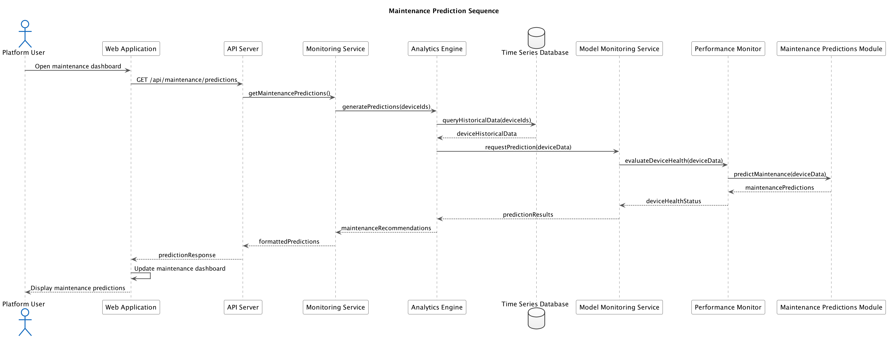

# Maintenance Predictions Architecture

## 1. System Architecture

```
┌─────────────────┐      ┌───────────────────────┐      ┌───────────────────┐
│                 │      │                       │      │                   │
│  Data Pipeline  │─────▶│  Prediction Pipeline  │─────▶│  API Layer        │
│                 │      │                       │      │                   │
└─────────────────┘      └───────────────────────┘      └───────────────────┘
        │                           │                            │
        ▼                           ▼                            ▼
┌─────────────────┐      ┌───────────────────────┐      ┌───────────────────┐
│                 │      │                       │      │                   │
│  Data Storage   │      │  Model Registry       │      │  Frontend         │
│                 │      │                       │      │                   │
└─────────────────┘      └───────────────────────┘      └───────────────────┘
```

The Maintenance Predictions architecture follows Test-Driven Development principles and consists of the following key components:

## 2. Component Description

### 2.1 Data Pipeline
- **Data Collectors**: Gather telemetry from IoT devices
- **Data Preprocessors**: Clean and normalize data for model consumption
- **Feature Extractors**: Generate relevant features for predictive models

### 2.2 Prediction Pipeline
- **Model Selector**: Chooses appropriate models based on device types
- **Inference Engine**: Executes ML models to generate predictions
- **Confidence Calculator**: Determines reliability of predictions
- **Explainability Module**: Provides reasoning behind predictions

### 2.3 API Layer
- **REST Endpoints**: Standard interfaces for prediction services
- **GraphQL Interface**: Flexible querying for dashboards
- **WebSocket Service**: Real-time updates for critical predictions

### 2.4 Data Storage
- **Time Series Database**: Historical device measurements
- **Feature Store**: Pre-computed features for model training
- **Prediction Storage**: Historical predictions for validation

### 2.5 Model Registry
- **Model Versioning**: Tracks model versions and performance
- **A/B Testing Framework**: Compares model variations
- **Model Metadata**: Stores information about model training and parameters

### 2.6 Frontend
- **Operations Dashboard**: Real-time view of device health
- **Prediction Timeline**: Visual display of maintenance predictions
- **Configuration Interface**: Tools for adjusting prediction parameters

## 3. Data Flow

1. Device telemetry data flows through the Data Pipeline
2. The Prediction Pipeline processes data and generates maintenance predictions
3. Predictions are stored and made available through the API Layer
4. The Frontend consumes predictions and presents them to users

## 4. Implementation Approach

The implementation follows the TDD (Test-Driven Development) principles:

### RED Phase
- Write tests that define expected prediction accuracy
- Create test cases for different device scenarios
- Establish metrics for model performance evaluation

### GREEN Phase
- Implement the prediction pipeline to satisfy tests
- Develop the model registry with versioning
- Create API endpoints for data access

### REFACTOR Phase
- Optimize model performance and execution speed
- Enhance data preprocessing for better feature extraction
- Improve error handling and fault tolerance

## 5. Key Technologies

- **InfluxDB**: Time series database for telemetry storage
- **scikit-learn/TensorFlow**: ML frameworks for predictive models
- **FastAPI**: Modern API framework for prediction services
- **React/Angular**: Frontend framework for dashboard components

## 6. Performance Considerations

- Batch processing for historical analysis
- Stream processing for real-time prediction updates
- Caching strategies for frequently accessed predictions
- Scalable infrastructure for handling increasing device counts

## 7. Testing Strategy

In line with TDD principles, the maintenance prediction system includes:

- **Unit Tests**: Testing individual components in isolation
- **Integration Tests**: Verifying correct interaction between components
- **System Tests**: End-to-end verification of prediction workflows
- **Performance Tests**: Ensuring predictions are generated within SLA
- **Model Validation Tests**: Confirming prediction accuracy meets requirements

## 8. Sequence Diagram



This sequence diagram illustrates the flow of a maintenance prediction request from the user interface through the system components.
