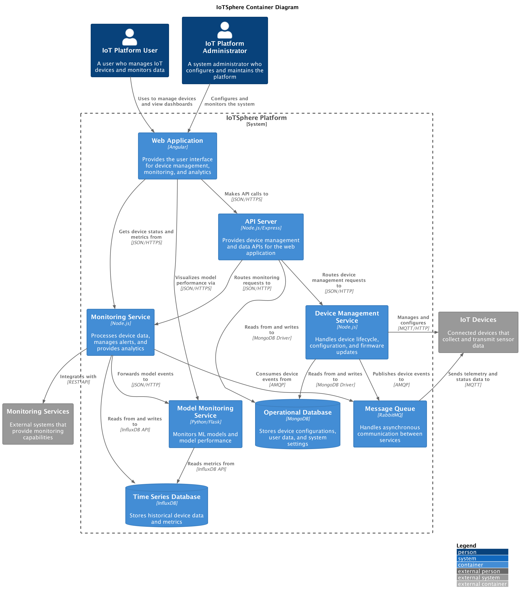
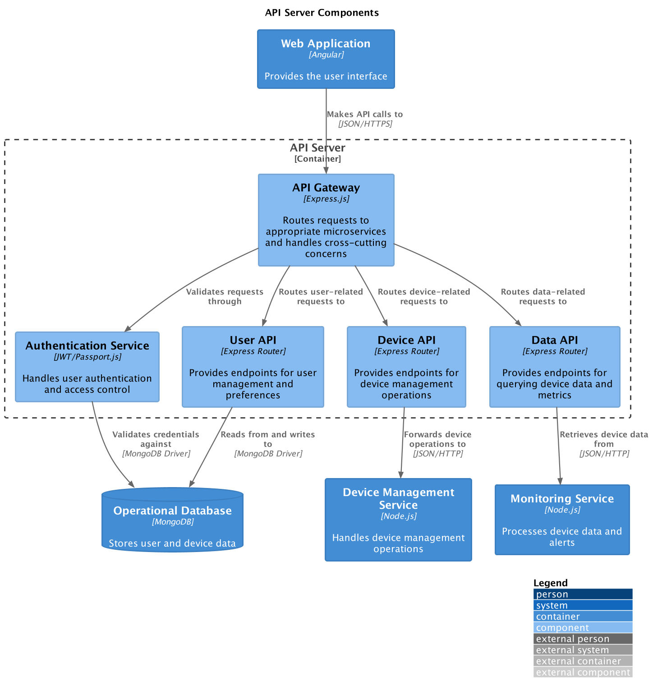
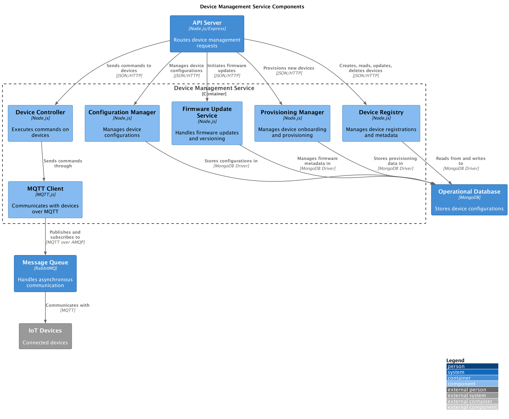
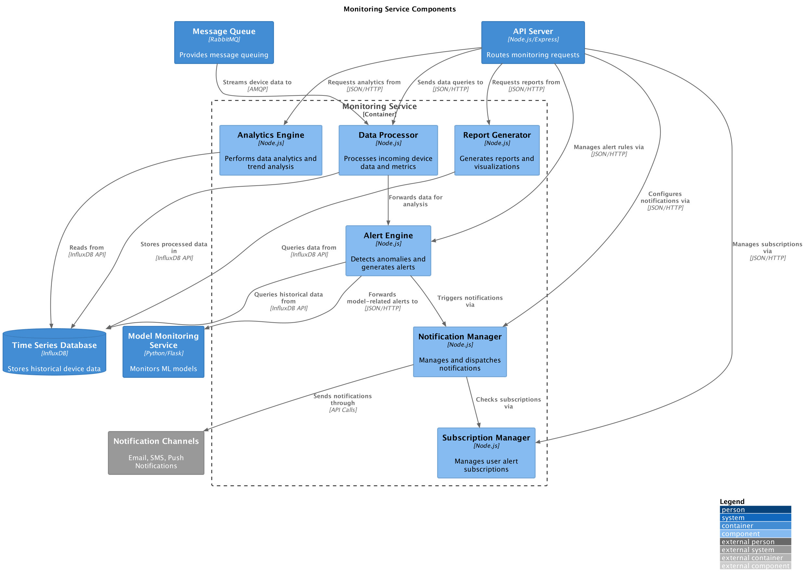
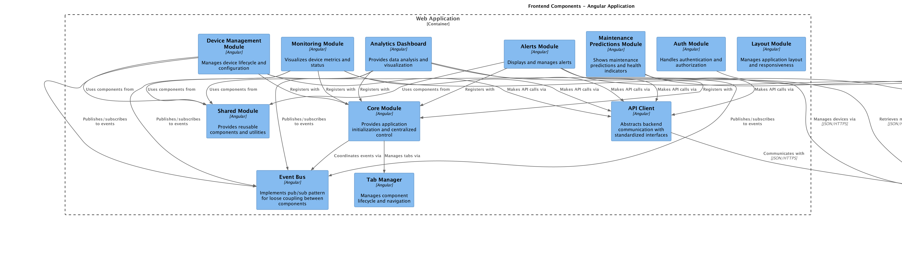
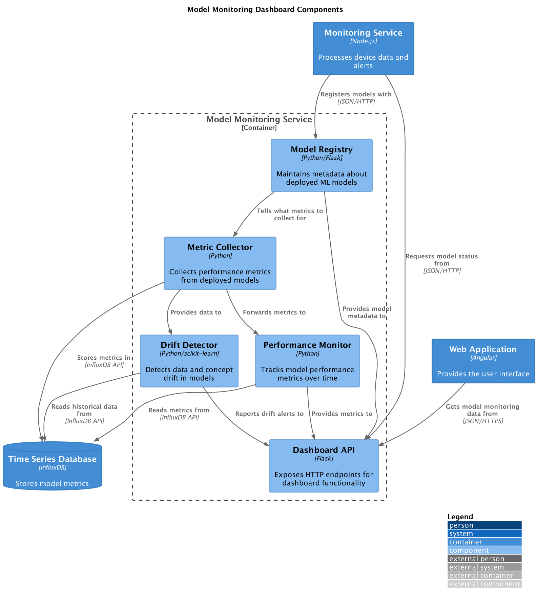
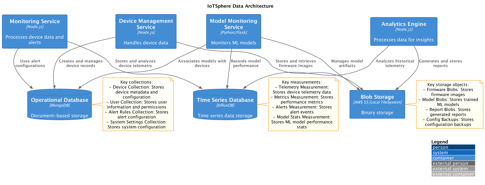
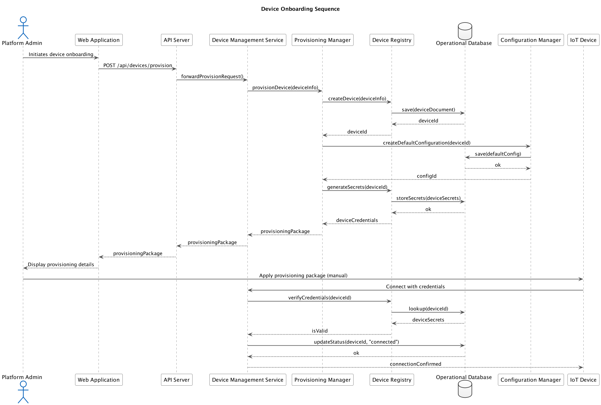
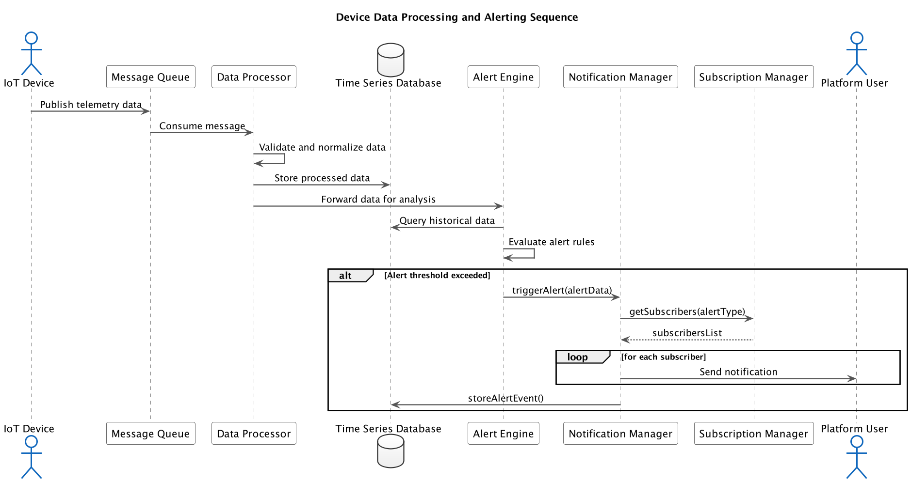

# IoTSphere Architecture Documentation

## Introduction

This document provides a comprehensive overview of the IoTSphere platform architecture. IoTSphere is a modern IoT platform that enables users to manage connected devices, collect and analyze sensor data, and receive alerts based on predefined conditions. The architecture documentation follows Test-Driven Development (TDD) principles, ensuring that the architecture evolves in a maintainable and verifiable way.

## Architectural Approach

The IoTSphere platform follows these key architectural principles:

1. **Microservices Architecture**: Dividing the system into independent, loosely coupled services that can be developed, deployed, and scaled independently.
2. **Event-Driven Communication**: Using message queues for asynchronous communication between services, enabling resilience and scalability.
3. **Test-Driven Development**: Following the RED-GREEN-REFACTOR cycle for all new features and changes.
4. **Separation of Concerns**: Clear boundaries between different system components, making the system easier to test and maintain.
5. **API-First Design**: Well-defined APIs for all services, enabling independent development and testing.

## System Context

The System Context diagram shows the IoTSphere platform and how it interacts with users and external systems.

The IoTSphere platform interacts with:

- **IoT Platform Users**: Who manage devices and monitor data
- **IoT Platform Administrators**: Who configure and maintain the platform
- **IoT Devices**: Which connect to the platform to send telemetry data and receive commands
- **Monitoring Services**: External systems that provide monitoring capabilities
- **Data Storage Systems**: Persistent storage for device data and analytics

## Container Architecture

The Container diagram shows the high-level technical components that make up the IoTSphere platform.

The IoTSphere platform consists of these key containers:

- **Web Application**: Angular-based frontend for user interaction
- **API Server**: Node.js/Express service that provides APIs for the web application
- **Device Management Service**: Handles device lifecycle, configuration, and firmware updates
- **Monitoring Service**: Processes device data, manages alerts, and provides analytics
- **Model Monitoring Service**: Monitors ML models and provides model performance metrics
- **Operational Database**: MongoDB database for storing device configurations and system settings
- **Time Series Database**: InfluxDB for storing historical device data and metrics
- **Message Queue**: RabbitMQ for asynchronous communication between services

## Component Architecture

### API Server Components

The API Server exposes REST endpoints and routes requests to appropriate microservices.

Key components:
- **API Gateway**: Routes requests and handles cross-cutting concerns
- **Authentication Service**: Handles user authentication and access control
- **Device API**: Provides endpoints for device management operations
- **Data API**: Provides endpoints for querying device data and metrics
- **User API**: Provides endpoints for user management and preferences

### Device Management Service Components

The Device Management Service handles device lifecycle, configuration, and firmware updates.

Key components:
- **Device Registry**: Manages device registrations and metadata
- **Configuration Manager**: Manages device configurations
- **Firmware Update Service**: Handles firmware updates and versioning
- **Provisioning Manager**: Manages device onboarding and provisioning
- **Device Controller**: Executes commands on devices
- **MQTT Client**: Communicates with devices over MQTT

### Monitoring Service Components

The Monitoring Service processes device data, manages alerts, and provides analytics.

Key components:
- **Data Processor**: Processes incoming device data and metrics
- **Alert Engine**: Detects anomalies and generates alerts
- **Analytics Engine**: Performs data analytics and trend analysis
- **Report Generator**: Generates reports and visualizations
- **Notification Manager**: Manages and dispatches notifications
- **Subscription Manager**: Manages user alert subscriptions

### Frontend Components

The frontend architecture follows a modular, component-based approach that facilitates Test-Driven Development.

Key components:
- **Core Module**: Provides application initialization and centralized control
- **API Client**: Abstracts backend communication with standardized interfaces
- **Tab Manager**: Manages component lifecycle and navigation
- **Event Bus**: Implements pub/sub pattern for loose coupling between components
- **Dashboard Modules**: Implement specific functionality as self-contained units
  - Device Management Module
  - Monitoring Module
  - Analytics Dashboard
  - Alerts Module
  - Maintenance Predictions Module
- **Auth Module**: Handles authentication and authorization
- **Shared Module**: Provides reusable components and utilities
- **Layout Module**: Manages application layout and responsiveness

### Model Monitoring Dashboard Components

The Model Monitoring Dashboard provides visibility into ML model performance.

Key components:
- **Model Registry**: Maintains metadata about deployed ML models
- **Metric Collector**: Collects performance metrics from deployed models
- **Drift Detector**: Detects data and concept drift in models
- **Performance Monitor**: Tracks model performance metrics over time
- **Dashboard API**: Exposes HTTP endpoints for dashboard functionality

## Data Architecture

The data architecture diagram shows how data flows through the system and is stored in different databases.

The IoTSphere platform uses multiple data stores:

1. **Operational Database (MongoDB)**:
   - Device Collection: Stores device metadata and configuration
   - User Collection: Stores user information and permissions
   - Alert Rules Collection: Stores alert configuration
   - System Settings Collection: Stores system configuration

2. **Time Series Database (InfluxDB)**:
   - Telemetry Measurement: Stores device telemetry data
   - Metrics Measurement: Stores performance metrics
   - Alerts Measurement: Stores alert events
   - Model Stats Measurement: Stores ML model performance stats

3. **Blob Storage (AWS S3/Local FileSystem)**:
   - Firmware Blobs: Stores firmware images
   - Model Blobs: Stores trained ML models
   - Report Blobs: Stores generated reports
   - Config Backups: Stores configuration backups

## Sequence Diagrams

### Device Onboarding Sequence

This sequence diagram illustrates the process of onboarding a new device to the IoTSphere platform.

The onboarding process involves:
1. Admin initiates device onboarding through the web application
2. The API server forwards the request to the Device Management Service
3. The Provisioning Manager creates the device in the Device Registry
4. Default configuration is created for the device
5. Device credentials are generated and stored
6. The admin applies the provisioning package to the device
7. The device connects to the platform using the credentials
8. The device connection is verified and confirmed

### Data Processing and Alerting Sequence

This sequence diagram shows how device data is processed and how alerts are generated.

The data processing flow includes:
1. IoT device publishes telemetry data to the Message Queue
2. Data Processor consumes the message, validates and normalizes the data
3. Processed data is stored in the Time Series Database
4. Data is forwarded to the Alert Engine for analysis
5. Alert Engine evaluates alert rules against historical data
6. If an alert threshold is exceeded, a notification is triggered
7. Subscribers to the alert are notified
8. The alert event is stored in the database

### Maintenance Prediction Sequence

This sequence diagram illustrates how maintenance predictions are generated for devices.

The maintenance prediction process involves:
1. User opens the maintenance dashboard in the web application
2. The application requests maintenance predictions from the API server
3. The Monitoring Service forwards the request to the Analytics Engine
4. The Analytics Engine queries historical data from the Time Series Database
5. The Analytics Engine requests predictions from the Model Monitoring Service
6. The Performance Monitor evaluates device health
7. The Maintenance Predictions Module generates predictions
8. Results are returned to the web application and displayed to the user

## Test-Driven Development Approach

All architectural components are developed following Test-Driven Development (TDD) principles:

1. **RED Phase**: Write failing tests that define expected functionality
   - Define expected component interactions
   - Specify required interfaces and behaviors
   - Create tests that verify these expectations

2. **GREEN Phase**: Write minimal code to make tests pass
   - Implement the components with minimal features
   - Focus on satisfying the test requirements
   - Ensure all tests pass before moving forward

3. **REFACTOR Phase**: Improve code quality while maintaining passing tests
   - Enhance performance, readability, and maintainability
   - Apply design patterns and best practices
   - Verify that all tests still pass after refactoring

This approach ensures that the architecture evolves in a maintainable, verifiable way, with clear requirements and high test coverage.

## Integration and Deployment

The IoTSphere platform can be deployed in various environments:

1. **Development**: Local Docker-based deployment for development and testing
2. **Staging**: Cloud-based deployment for integration testing
3. **Production**: Fully scalable Kubernetes deployment

The deployment process follows these principles:

1. **Infrastructure as Code**: All infrastructure is defined in code and version-controlled
2. **Continuous Integration**: Automated testing and building of components
3. **Continuous Deployment**: Automated deployment to environments
4. **Observability**: Comprehensive monitoring and logging of all components

## Conclusion

The IoTSphere architecture provides a scalable, maintainable foundation for IoT device management and monitoring. By following Test-Driven Development principles, the architecture ensures that all components are well-tested and meet requirements. The microservices approach allows for independent development and deployment of components, making the system flexible and adaptable to changing requirements.
