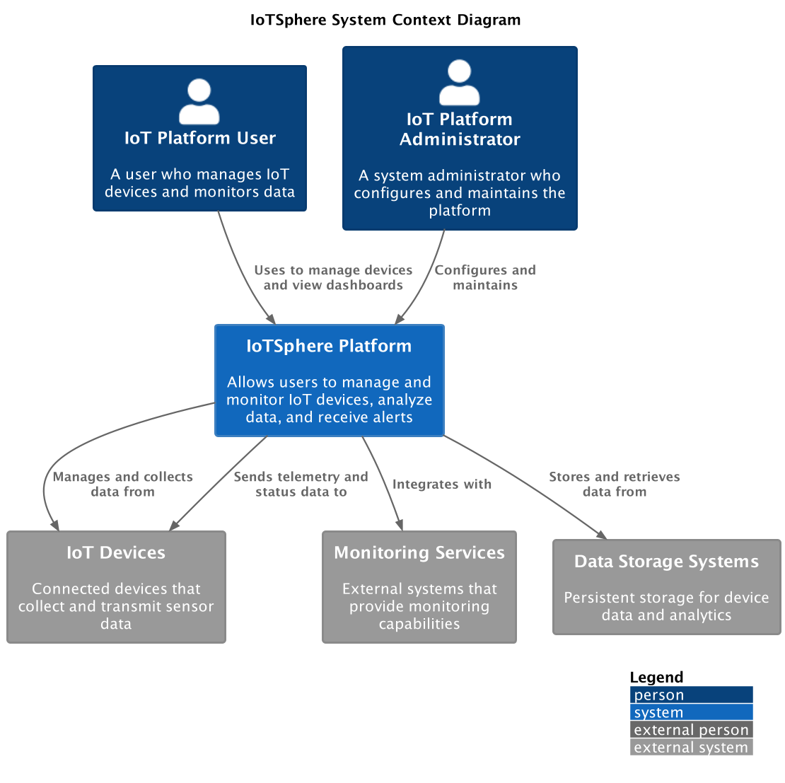

# IoTSphere-Refactor Architecture Documentation

## Introduction

This document provides a comprehensive overview of the IoTSphere-Refactor project architecture. This refactored backend implements a modern IoT platform that enables management of connected devices (with a focus on water heaters and vending machines), predictive analytics, and monitoring of ML model performance. The architecture documentation follows Test-Driven Development (TDD) principles, ensuring that the system evolves in a maintainable and verifiable way.

## Architectural Approach

The IoTSphere-Refactor project follows these key architectural principles:

1. **Environment-Based Configuration**: Implementing a centralized, layered configuration system that adapts to different environments (development, production).
2. **Repository Pattern**: Abstracting data access through repositories that can be configured for different backends or mock implementations.
3. **Test-Driven Development**: Following the RED-GREEN-REFACTOR cycle for all new features and changes.
4. **Separation of Concerns**: Clear boundaries between different system components, making the system easier to test and maintain.
5. **API-First Design**: Well-defined FastAPI endpoints with clear input/output contracts.

## System Context

The IoTSphere-Refactor project provides a backend service layer with the following interactions:

*Figure 1: IoTSphere System Context - Illustrating key system boundaries and external interactions*

- **REST API Clients**: Frontend applications or other services that consume the REST API
- **Water Heater Devices**: Primary IoT device type with temperature control, maintenance prediction, and monitoring
- **Vending Machines**: Secondary device type with inventory and sales tracking
- **Data Storage Systems**: SQLite (development) and PostgreSQL (production) databases
- **ML Model Services**: Integration with prediction models for device maintenance and health monitoring

## Core Components

The IoTSphere-Refactor backend consists of these key components:

*Figure 2: Container Architecture - Showing the high-level components of the IoTSphere system*

- **FastAPI Application**: Main entry point that provides RESTful API endpoints
- **Config Service**: Environment-based configuration system with YAML files and fallback mechanisms
- **Water Heater Service**: Handles water heater operations, status, and maintenance data
- **Vending Machine Service**: Manages vending machine inventory and operations
- **Prediction Services**: Analytics for device failure prediction, maintenance scheduling, and anomaly detection
- **Model Monitoring Service**: Tracks ML model performance, drift, and alerts on model issues
- **Relational Database**: SQLite (development) or PostgreSQL (production) for storing all persistent data

## Detailed Component Architecture

### FastAPI Endpoints

The FastAPI application exposes structured REST endpoints organized by device/service type:

- **/api/water-heaters**: Endpoints for water heater management
  - GET, POST, PUT operations for CRUD operations
  - Status updates and temperature control
  - Historical readings and maintenance records

- **/api/predictions/water-heaters**: Advanced prediction endpoints
  - `/{device_id}/lifespan`: Lifespan estimation predictions
  - `/{device_id}/anomaly`: Anomaly detection results
  - `/{device_id}/usage-patterns`: Usage pattern analysis
  - `/{device_id}/multi-factor`: Combined analysis across factors
  - `/{device_id}/all`: Aggregated predictions from all models

- **/api/vending-machines**: Endpoints for vending machine operations
  - Inventory management
  - Sales tracking and restocking needs

- **/api/monitoring**: Model monitoring and health tracking
  - Model performance metrics
  - Drift detection notifications
  - Health status dashboards

### Configuration System

*Figure 3: Configuration Service Component Diagram - Showing the environment-based configuration system*

The environment-based configuration system consists of:

- **Config Service**: Central service that loads and serves configuration
- **Environment Detection**: Logic to determine current environment (development/production)
- **YAML Config Files**: Environment-specific configuration files
- **Fallback Mechanism**: Cascading fallback for missing configuration values

### Water Heater Service

*Figure 4: Water Heater Service Component Diagram - Detailing the internal structure of the Water Heater Service*

The Water Heater service provides functionality for water heater management:

- **Configurable Repository**: Switchable between mock data and real database
- **Device Operations**: CRUD operations and status management
- **Temperature Control**: Logic for temperature adjustments and monitoring
- **Historical Data**: Collection and retrieval of historical readings

### Vending Machine Service

*Figure 5: Vending Machine Service Component Diagram - Detailing the internal structure of the Vending Machine Service*

The Vending Machine service manages vending machine operations:

- **Inventory Management**: Tracking product availability and stock levels
- **Sales Tracking**: Recording sales transactions and patterns
- **Restocking Alerts**: Notifications for low inventory items
- **Product Configuration**: Management of product offerings and pricing

### Prediction Services

*Figure 6: Prediction Endpoints Component Diagram - Showing the structure of prediction services and their interactions*

Prediction services provide analytical capabilities for water heaters and other devices:

- **Lifespan Estimation**: Predicts device end-of-life
- **Anomaly Detection**: Identifies abnormal operating conditions
- **Usage Pattern Analysis**: Discovers usage trends and optimization opportunities
- **Multi-factor Analysis**: Combines multiple data sources for comprehensive insights

### Model Monitoring Service

*Figure 7: Model Monitoring Service Component Diagram - Detailing the components for monitoring ML model performance*

The Model Monitoring Service tracks ML model performance:

- **Metrics Repository**: Collects and stores model performance metrics
- **Model Registry**: Catalog of available prediction models
- **Health Status Tracker**: Monitors model health and quality
- **Alert System**: Notifications for model drift or degradation

## Data Architecture

*Figure 8: Data Architecture Diagram - Showing the relational database schema and table relationships*

The IoTSphere-Refactor project uses a relational database schema with the following key tables:

1. **Device Tables**:
   - `water_heaters`: Water heater device metadata and configuration
   - `water_heater_readings`: Historical temperature and performance readings
   - `vending_machines`: Vending machine metadata and status
   - `vending_machine_products`: Product inventory for vending machines
   - `vending_machine_readings`: Sales and operational data points

2. **Prediction and Analytics Tables**:
   - `predictions`: Stored prediction results
   - `prediction_models`: Metadata about available prediction models
   - `prediction_features`: Feature sets used for predictions
   - `anomaly_detections`: Detected anomalies and classifications

3. **Model Monitoring Tables**:
   - `model_metrics`: Performance metrics for ML models
   - `model_health`: Health status and quality indicators
   - `model_alerts`: Alert events for model issues
   - `model_drift_data`: Data for tracking model drift over time

## Key Interactions

### Water Heater CRUD Operations

*Figure 9: Water Heater CRUD Operations Sequence - Illustrating the flow of create, read, update, and delete operations*

The IoTSphere-Refactor implements standard CRUD operations for water heater management:

1. Create: Adding new water heater devices to the system
2. Read: Retrieving water heater information by ID or with filters
3. Update: Modifying water heater configuration, settings, and status
4. Delete: Removing water heater devices from the system

### Water Heater Prediction Request Flow

*Figure 10: Water Heater Prediction Sequence - Detailing the interactions during a prediction request*

A typical flow for water heater prediction requests:

1. Client makes a request to `/api/predictions/water-heaters/{device_id}/lifespan`
2. FastAPI router routes the request to the appropriate prediction handler
3. The handler retrieves device data from the Water Heater repository
4. Prediction model is loaded with appropriate configuration for the environment
5. Prediction is executed with device data and model parameters
6. Contributing factors are identified from device features
7. Recommendations are generated based on predicted maintenance needs
8. Results are formatted with prediction details, confidence levels, and recommendations
9. Response is returned to the client with structured prediction data

### Model Monitoring Alert Flow

*Figure 11: Model Monitoring Alert Flow - Showing the sequence of metrics collection, evaluation, and alerting*

The flow for model monitoring alerts:

1. Model metrics are collected periodically from prediction services
2. Metrics are stored in the Model Metrics Repository
3. Health status is evaluated against configurable thresholds
4. If metrics indicate degradation or drift, alerts are generated
5. Alerts are stored in the database with severity and impact assessment
6. API endpoints expose current alert status for monitoring dashboards

### Environment-Based Configuration Flow

*Figure 12: Environment-Based Configuration Loading Sequence - Illustrating how configuration is loaded based on the environment*

The process for loading environment-specific configuration:

1. Application startup detects the current environment from APP_ENV variable
2. Configuration service loads the appropriate YAML file (development.yaml or production.yaml)
3. Service-specific configuration sections are extracted for each component
4. If a configuration value is missing, fallback values are used from default configuration
5. Services initialize with environment-appropriate settings (mock data vs. real database)
6. Configuration values are available to components through dependency injection

## Test-Driven Development Approach

All architectural components are developed following Test-Driven Development (TDD) principles:

1. **RED Phase**: Write failing tests that define expected functionality
   - Define expected component interactions
   - Specify required interfaces and behaviors
   - Create tests that verify these expectations

2. **GREEN Phase**: Write minimal code to make tests pass
   - Implement the components with minimal features
   - Focus on satisfying the test requirements
   - Ensure all tests pass before moving forward

3. **REFACTOR Phase**: Improve code quality while maintaining passing tests
   - Enhance performance, readability, and maintainability
   - Apply design patterns and best practices
   - Verify that all tests still pass after refactoring

This approach ensures that the architecture evolves in a maintainable, verifiable way, with clear requirements and high test coverage.

## Integration and Deployment

The IoTSphere platform can be deployed in various environments:

1. **Development**: Local Docker-based deployment for development and testing
2. **Staging**: Cloud-based deployment for integration testing
3. **Production**: Fully scalable Kubernetes deployment

The deployment process follows these principles:

1. **Infrastructure as Code**: All infrastructure is defined in code and version-controlled
2. **Continuous Integration**: Automated testing and building of components
3. **Continuous Deployment**: Automated deployment to environments
4. **Observability**: Comprehensive monitoring and logging of all components

## Conclusion

The IoTSphere architecture provides a scalable, maintainable foundation for IoT device management and monitoring. By following Test-Driven Development principles, the architecture ensures that all components are well-tested and meet requirements. The microservices approach allows for independent development and deployment of components, making the system flexible and adaptable to changing requirements.
