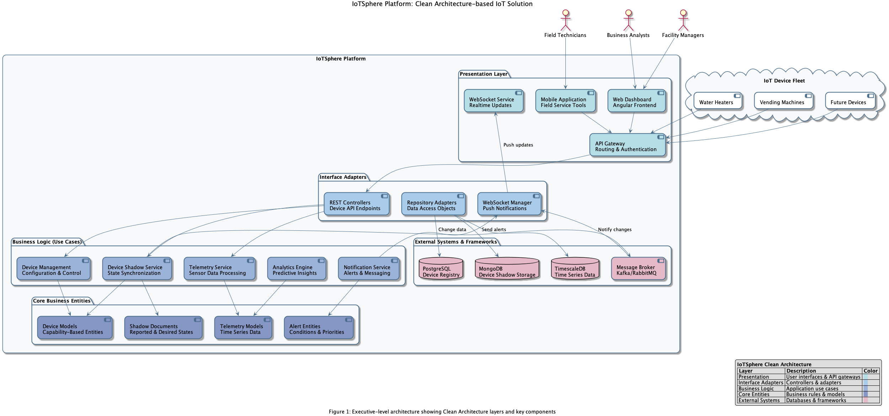

# IoTSphere Revised Core Architecture

## 1. Executive Summary

This document describes the revised architecture for IoTSphere, emphasizing a production-grade approach to building a device-agnostic IoT platform. It incorporates best practices from enterprise IoT systems with a focus on separation of concerns, scalability, and real-time processing capabilities.

## 2. Architectural Principles

- **Separation of Concerns**: Distinct services and databases for device identity, asset management, telemetry, and state
- **Real-time First**: Architecture optimized for real-time data processing and user interface updates
- **Simulation Over Mocking**: Preference for simulated devices that mimic real-world behavior over pure mocks
- **Clear Mock Indication**: Visual indicators and logging when simulated data is in use
- **Capability-Based Modeling**: Devices defined by their capabilities, enabling flexibility across device types
- **Event-Driven Architecture**: Asynchronous communication via event bus for system scalability

## 3. System Architecture

### 3.1 Executive Marketecture

For executive stakeholders, we provide a high-level marketecture overview that illustrates the Clean Architecture principles and device-agnostic approach of the IoTSphere platform.


*Figure 1: Clean Architecture-based IoT Platform Marketecture*

Please refer to the [IoTSphere Marketecture Document](marketecture.md) for a comprehensive executive-level overview of the system architecture.

*Figure 1: Clean Architecture-based IoT Platform Marketecture*

> **Note:** The above diagram is generated from the PlantUML source file at `docs/diagrams/iotsphere_marketecture.puml`. See [Architecture Diagram Notes](architecture-note.md) for details on viewing these diagrams.

### 3.2 High-Level Architecture

The following diagram shows the high-level architecture with key components and their relationships:

```
┌───────────────────────────────────────────────────────────────┐
│                     Client Applications                        │
└───────────────────────────────────────────────────────────────┘
                            ▲
                            │
┌───────────────────────────────────────────────────────────────┐
│                         API Gateway                            │
└───────────────────────────────────────────────────────────────┘
                            ▲
                            │
           ┌───────────────┴───────────────┐
           │                               │
┌─────────────────────┐         ┌─────────────────────┐
│    REST APIs        │         │  WebSocket Service  │
│  (Device Control)   │         │  (Real-time Events) │
└─────────────────────┘         └─────────────────────┘
           ▲                               ▲
           │                               │
┌─────────────────────┐         ┌─────────────────────┐
│   Service Layer     │         │     Event Bus       │
│ (Business Logic)    │◄────────┤    (Kafka/RabbitMQ) │
└─────────────────────┘         └─────────────────────┘
           ▲                               ▲
           │                               │
           │                     ┌─────────────────────┐
           │                     │ Device Shadow Service│
           │                     └─────────────────────┘
           │                               ▲
           │                               │
┌─────────────────────┐         ┌─────────────────────┐
│  Persistent Storage │         │   NoSQL Database    │
│    (PostgreSQL)     │         │     (MongoDB)       │
└─────────────────────┘         └─────────────────────┘
```

**Figure 1: High-Level System Architecture**

The IoTSphere platform consists of the following major components:

```
┌───────────────────────────────────────────────────────────────┐
│                     Client Applications                        │
└───────────────────────────────────────────────────────────────┘
                            ▲
                            │
┌───────────────────────────────────────────────────────────────┐
│                         API Gateway                            │
└───────────────────────────────────────────────────────────────┘
                            ▲
                            │
           ┌───────────────┴───────────────┐
           │                               │
┌─────────────────────┐         ┌─────────────────────┐
│    REST APIs        │         │  WebSocket Service  │
│  (Device Control)   │         │  (Real-time Events) │
└─────────────────────┘         └─────────────────────┘
           ▲                               ▲
           │                               │
┌─────────────────────┐         ┌─────────────────────┐
│   Service Layer     │         │     Event Bus       │
│ (Business Logic)    │◄────────┤    (Kafka/RabbitMQ) │
└─────────────────────┘         └─────────────────────┘
           ▲                               ▲
           │                               │
           │                     ┌─────────────────────┐
           │                     │  Device Simulator   │
           │                     │    (Fake Devices)   │
           │                     └─────────────────────┘
           │                               │
┌─────────────────────┐                    │
│  Device Registry    │                    │
│  (PostgreSQL)       │                    │
└─────────────────────┘                    │
           ▲                               │
           │                               │
┌─────────────────────┐         ┌─────────────────────┐
│   Asset Database    │         │   Device Shadow     │
│   (PostgreSQL)      │         │   (Redis)           │
└─────────────────────┘         └─────────────────────┘
                                          ▲
                                          │
                                ┌─────────────────────┐
                                │ Telemetry Storage   │
                                │   (TimescaleDB)     │
                                └─────────────────────┘
```

### 3.2 Data Storage Architecture

We implement a multi-database approach optimized for different IoT data patterns:

#### 3.2.1 Device Registry Database

**Purpose**: Fast, reliable device identity and authentication

**Technology**: PostgreSQL

**Schema Highlights**:
```sql
CREATE TABLE devices (
    id VARCHAR PRIMARY KEY,
    device_key VARCHAR NOT NULL,
    device_type VARCHAR NOT NULL,
    manufacturer VARCHAR NOT NULL,
    status VARCHAR NOT NULL,
    last_connected TIMESTAMP,
    created_at TIMESTAMP NOT NULL,
    certificate_info JSONB
);
```

#### 3.2.2 Asset Database

**Purpose**: Rich device metadata, capabilities, and relationships

**Technology**: PostgreSQL with JSONB for flexible schemas

**Schema Highlights**:
```sql
CREATE TABLE assets (
    asset_id VARCHAR PRIMARY KEY,
    device_id VARCHAR REFERENCES devices(id),
    name VARCHAR NOT NULL,
    model VARCHAR NOT NULL,
    firmware_version VARCHAR,
    install_date TIMESTAMP,
    location_id VARCHAR REFERENCES locations(id),
    owner_id VARCHAR REFERENCES organizations(id),
    metadata JSONB
);

CREATE TABLE asset_capabilities (
    asset_id VARCHAR REFERENCES assets(asset_id),
    capability_id VARCHAR REFERENCES capabilities(id),
    implementation VARCHAR NOT NULL,
    configuration JSONB,
    PRIMARY KEY (asset_id, capability_id)
);
```

#### 3.2.3 Device Shadow (Real-time State)

**Purpose**: Current device state and desired state storage

**Technology**: Redis

**Key Structure**:
```
device:{device_id}:reported    -- Current reported state
device:{device_id}:desired     -- Desired state (for commands)
device:{device_id}:delta       -- Difference between reported and desired
```

#### 3.2.4 Telemetry Storage

**Purpose**: High-performance time-series data storage

**Technology**: TimescaleDB (PostgreSQL extension)

**Schema Highlights**:
```sql
CREATE TABLE telemetry (
    device_id VARCHAR NOT NULL,
    timestamp TIMESTAMPTZ NOT NULL,
    measurement VARCHAR NOT NULL,
    value DOUBLE PRECISION,
    metadata JSONB,
    PRIMARY KEY (device_id, timestamp, measurement)
);

-- Convert to hypertable with time partitioning
SELECT create_hypertable('telemetry', 'timestamp');
```

### 3.3 Event Processing Pipeline

#### 3.3.1 Event Bus

**Purpose**: Scalable message broker for system events

**Technology**: Apache Kafka or RabbitMQ

**Key Topics/Queues**:
- `device.status` - Device connectivity events
- `device.telemetry` - New telemetry data
- `device.command` - Commands sent to devices
- `device.update` - Device property updates
- `alert.generated` - System alerts

#### 3.3.2 WebSocket Service

**Purpose**: Real-time event delivery to client applications

**Technology**: Custom service with Socket.IO

**Features**:
- Authentication and authorization
- Device-specific channels
- Efficient connection pooling
- Automatic reconnection
- Event filtering

### 3.4 Simulation Infrastructure

#### 3.4.1 Device Simulator Framework

**Purpose**: Generate realistic device behavior for testing and development

**Technology**: Custom simulation engine

**Key Components**:
- Simulation Manager - Coordinates multiple simulated devices
- Device Behavior Models - Define realistic device behavior patterns
- Protocol Adapters - Connect via same protocols as real devices
- Scenario Runner - Execute predefined test scenarios

#### 3.4.2 Integration Indicators

**Purpose**: Clearly indicate when simulated data is being displayed

**Implementation**:
- UI Watermark - Visual indicator for simulated data
- API Headers - `X-Data-Source: simulation` for HTTP responses
- WebSocket Events - Include simulation flag in payload
- Logs - Clear indication in system logs

### 3.5 Service Architecture

The system is organized into the following services:

#### 3.5.1 Core Services
- **Device Registry Service** - Device identity and authentication
- **Asset Management Service** - Asset metadata and relationships
- **Telemetry Service** - Collection and storage of device telemetry
- **Command Service** - Send commands to devices
- **Event Processing Service** - Process and route system events
- **Notification Service** - Manage user and system notifications

#### 3.5.2 Analytics Services
- **Data Processing Service** - Preprocess and transform raw data
- **Analytics Engine** - Generate insights from device data
- **Prediction Service** - Execute prediction models
- **Business Intelligence Service** - Generate reports and visualizations

#### 3.5.3 Device Type-Specific Services
- **Water Heater Service** - Water heater-specific operations
- **Vending Machine Service** - Vending machine-specific operations
- **Robot Service** - Robot-specific operations

### 3.6 API Structure

#### 3.6.1 REST API

```
/api/v1/devices                # Device registry operations
/api/v1/assets                 # Asset operations
/api/v1/telemetry              # Telemetry access
/api/v1/commands               # Command operations
/api/v1/events                 # Event subscription management
/api/v1/analytics              # Analytics operations
/api/v1/predictions            # Prediction operations

# Device-specific endpoints
/api/v1/water-heaters          # Water heater operations
/api/v1/vending-machines       # Vending machine operations
/api/v1/robots                 # Robot operations

# Capability-based endpoints
/api/v1/capabilities/{capability}/{device-id}
```

#### 3.6.2 WebSocket API

```
/socket.io                     # WebSocket connection endpoint

# Event channels
device:{device_id}             # Device-specific events
user:{user_id}                 # User-specific notifications
type:{device_type}             # Events for all devices of a type
org:{org_id}                   # Organization-wide events
```

## 4. UI Architecture

### 4.1 Component Framework

The UI follows a modular component architecture that supports device-agnostic operation:

```
┌─────────────────────────────────────────────────────────────┐
│ Core UI Component Library                                   │
├─────────────────────────────────────────────────────────────┤
│ - DeviceCard                                                │
│ - StatusIndicator                                           │
│ - CommandPanel                                              │
│ - TelemetryDisplay                                          │
│ - AlertNotification                                         │
│ - TimeSeriesChart                                           │
│ - SimulationIndicator                                       │
└─────────────────────────────────────────────────────────────┘
                ▲
                │
    ┌───────────┼───────────┐
    │           │           │
┌─────────────────┐ ┌─────────────────┐ ┌─────────────────┐
│ WaterHeaterUI   │ │ VendingMachineUI│ │ RobotUI        │
├─────────────────┤ ├─────────────────┤ ├─────────────────┤
│ - TempGauge     │ │ - Inventory     │ │ - PathVisualizer│
│ - PressureGauge │ │ - SalesChart    │ │ - SensorArray   │
│ - ModeSelector  │ │ - CoinLevel     │ │ - BatteryStatus │
└─────────────────┘ └─────────────────┘ └─────────────────┘
```

### 4.2 Real-time Updates

The UI implements a WebSocket-based real-time update system:

1. Connect to WebSocket service on application load
2. Subscribe to relevant device channels
3. Update UI components when events are received
4. Implement reconnection and state synchronization
5. Display simulation indicator when data comes from simulated devices

## 5. Security Architecture

### 5.1 Authentication and Authorization

- JWT-based authentication for users and services
- Device authentication using certificates or secure tokens
- Role-based access control for API operations
- Organization-based multitenancy

### 5.2 Data Security

- Encryption at rest for sensitive data
- TLS for all communications
- Secure key management
- Audit logging for security-relevant operations

## 6. Development and Deployment Infrastructure

### 6.1 Development Environment

- Docker Compose for local development
- Development database with simulation data
- Local event bus for development
- Automated test data generation

### 6.2 Production Environment

- Kubernetes for container orchestration
- Managed PostgreSQL and TimescaleDB
- Redis cluster for device shadow
- Kafka/RabbitMQ for production event bus
- Prometheus and Grafana for monitoring

## 7. Implementation Roadmap

### 7.1 Phase 1: Infrastructure Setup (Weeks 1-4)

- Set up database infrastructure (PostgreSQL, TimescaleDB, Redis)
- Implement event bus (Kafka/RabbitMQ)
- Create WebSocket service
- Develop device simulator framework

### 7.2 Phase 2: Core Services (Weeks 5-8)

- Implement device registry service
- Create asset management service
- Build telemetry processing pipeline
- Develop command processing service

### 7.3 Phase 3: Water Heater Implementation (Weeks 9-12)

- Implement water heater-specific services
- Create water heater simulators
- Develop water heater UI components
- Build water heater analytics

### 7.4 Phase 4: Analytics and Prediction (Weeks 13-16)

- Implement analytics engine
- Create prediction service
- Develop business intelligence dashboards
- Build maintenance optimization tools

### 7.5 Future Phases

- Additional device type implementations
- Advanced cross-device analytics
- AI-driven automation
- Mobile application support

## 8. Conclusion

This revised architecture provides a solid foundation for a production-grade IoT platform that can handle the requirements specified in the BDD tests. The separation of concerns in the database architecture, along with the event-driven approach to real-time updates, ensures that the system will be scalable and maintainable as it grows to support multiple device types and advanced analytics capabilities.
