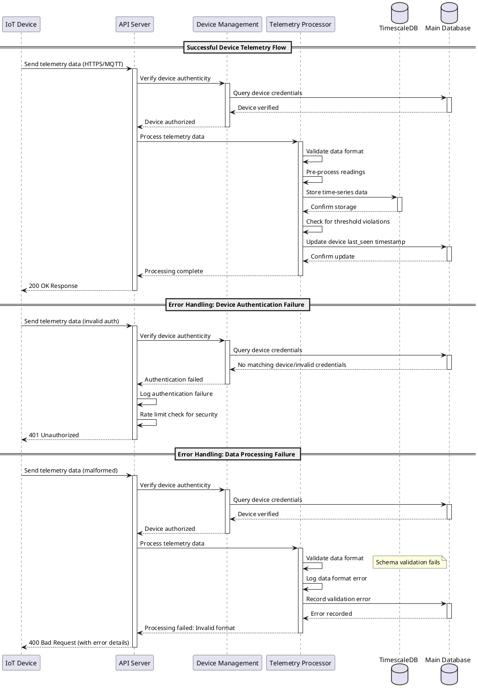
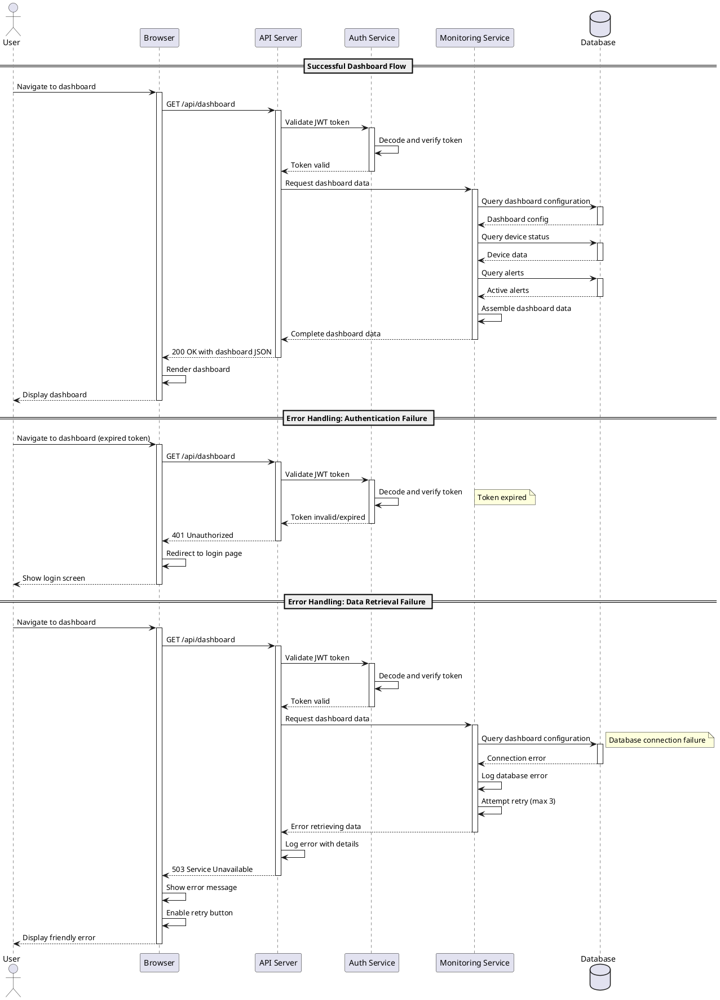
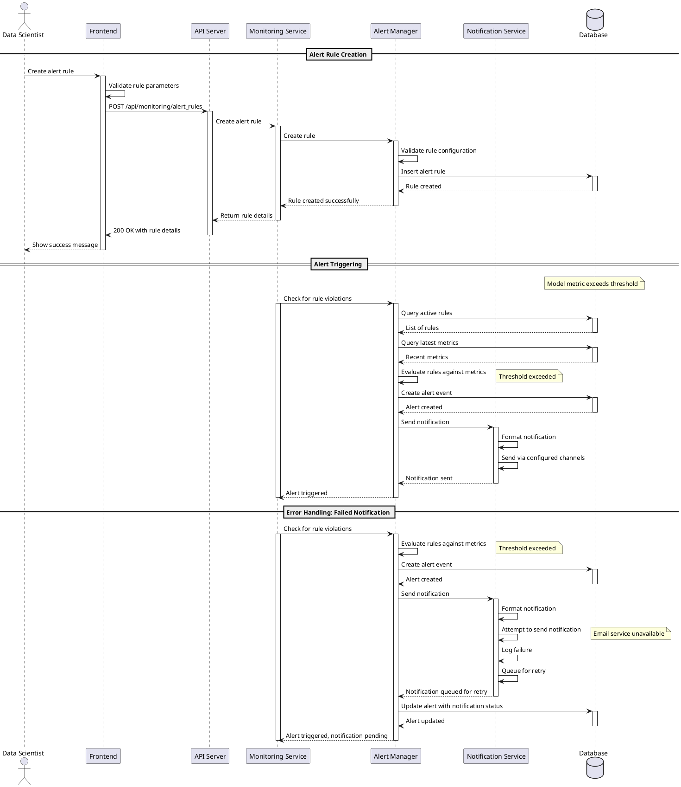

# IoTSphere Sequence Diagrams

This document provides comprehensive sequence diagrams that illustrate key system flows including error handling and recovery scenarios. Following our Test-Driven Development principles, these diagrams define expected behaviors that drive implementation.

## Device Data Flow

## User Dashboard Flow

## Model Monitoring Alert Flow

These sequence diagrams align with our Test-Driven Development approach by:

1. **Defining Expected Behavior**: The diagrams clearly document how components should interact in both successful and failure scenarios
2. **Guiding Implementation**: Developers can use these flows as specifications to implement components that satisfy the expected behaviors
3. **Supporting Testing**: Each interaction in the diagram can be validated through tests
4. **Documenting Error Handling**: Clear illustration of how the system should gracefully handle failures
